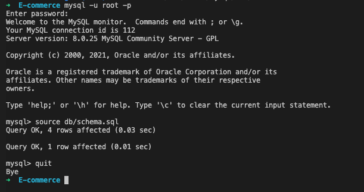
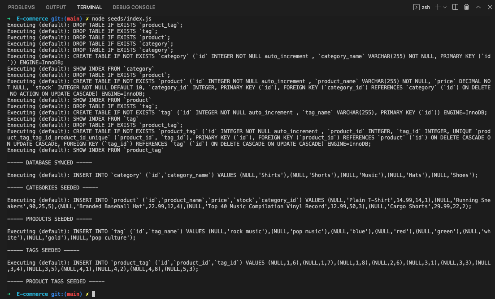

# ORM Ecommerce backend

## Description

- User can retrieve information from database through GET method
- User can add information to database through POST method
- User can update information in database through PUT method
- User can remove information from database through DELETE method

## Table of Contents

- [Installation](#installation)
- [Usage](#usage)
- [Credits](#credits)
- [License](#license)

## Installation

**Open console:**

If package.json file is present then type the command: `npm install`

_If no package.json file is present, type the command:_ `npm init -y` _then:_ `npm install dotenv express mysql2 sequelize`

## Usage

**Once installation is complete:**

Make sure MySQL is installed and enter the sql shell and run the command: `source db/schema.sql`

Exit the sql shell and run command:

`npm run seed` or `node seeds/index.js`

Then:

`npm start` or `node server.js`

**Below is video demonstrating the start up process and routes being tested in Insomnia Core:**

https://drive.google.com/file/d/1kaFApNCiDofmTd8P1qBojlPTC-LV5abE/view?usp=sharing

## Credits

https://gist.github.com/lukas-h/2a5d00690736b4c3a7ba

https://coding-boot-camp.github.io/full-stack/github/professional-readme-guide

https://www.npmjs.com/

https://dev.mysql.com/doc/refman/8.0/en/

https://stackoverflow.com/

https://www.mysqltutorial.org/

https://www.techonthenet.com/mysql/index.php

## License

MIT License

Copyright (c) 2021 Mark Lindskog

Permission is hereby granted, free of charge, to any person obtaining a copy
of this software and associated documentation files (the "Software"), to deal
in the Software without restriction, including without limitation the rights
to use, copy, modify, merge, publish, distribute, sublicense, and/or sell
copies of the Software, and to permit persons to whom the Software is
furnished to do so, subject to the following conditions:

The above copyright notice and this permission notice shall be included in all
copies or substantial portions of the Software.

THE SOFTWARE IS PROVIDED "AS IS", WITHOUT WARRANTY OF ANY KIND, EXPRESS OR
IMPLIED, INCLUDING BUT NOT LIMITED TO THE WARRANTIES OF MERCHANTABILITY,
FITNESS FOR A PARTICULAR PURPOSE AND NONINFRINGEMENT. IN NO EVENT SHALL THE
AUTHORS OR COPYRIGHT HOLDERS BE LIABLE FOR ANY CLAIM, DAMAGES OR OTHER
LIABILITY, WHETHER IN AN ACTION OF CONTRACT, TORT OR OTHERWISE, ARISING FROM,
OUT OF OR IN CONNECTION WITH THE SOFTWARE OR THE USE OR OTHER DEALINGS IN THE
SOFTWARE.
